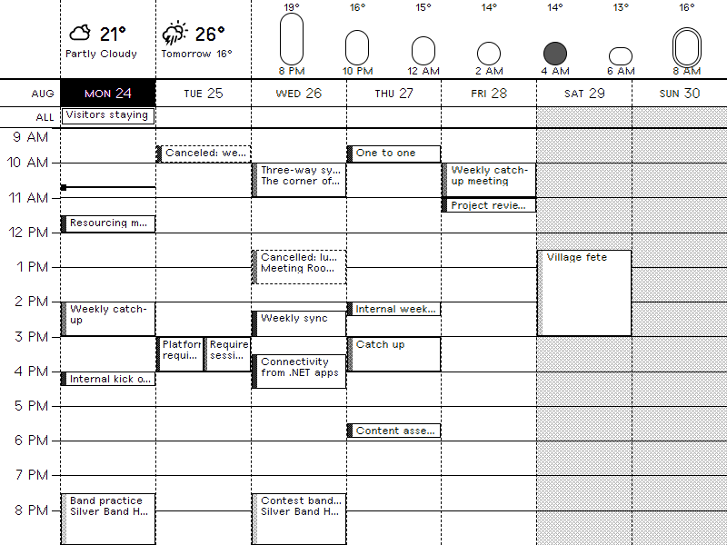

# Week + Weather: a TRMNL plugin merge



A single TRMNL private plugin that draws a rolling-week time grid in the style of
Google Calendar's week view, under a weather strip with an hourly temperature
graph. It fetches nothing itself: the **Plugin Merge** strategy hands it the
parsed JSON of plugins you already have connected.

Three sources, all picked from dropdowns in the plugin's own settings:

| Field | Plugin | Supplies |
|---|---|---|
| `calendar_source` | Google Calendar | events, colours, and that plugin's display preferences |
| `weather_source` | Weather (any provider) | now, today, tomorrow |
| `hourly_source` | Weather Glance recipe | the next few hours as bars (optional) |

Target panel is 800x600 at 2-bit greyscale, i.e. a Kindle 4 in landscape at
about 167 PPI. That is denser than the TRMNL original (800x480 at ~137 PPI), so
the layout spends the extra height on larger text rather than on more rows. Set
**Screen height** for a different panel.

Other preview renders, all from the sample payload in `.trmnlp.yml`:
`_build/full-dense.png` (stress payload), `_build/half_horizontal.png`,
`_build/half_vertical.png`, `_build/quadrant.png`.

## What the full layout shows

- **A rolling week.** Today is the first column, seven columns by default. Set
  **First column** to `week` to pin column one to the start of your week.
- **Hour rows covering the window your calendar plugin already computes**
  (`scroll_time` to `scroll_time_end`), so the day fills the screen. Override
  with **First hour** / **Last hour**. Labels are centred on their gridline with
  a tick into the grid. The window is capped at 14 hours, fewer on a short
  panel, so a single early or late outlier cannot squeeze the working day into
  unreadable rows. Events left outside it are counted in a `+N` badge on the day
  heading.
- **Timed events as blocks** positioned and sized by their real times. Blocks
  carry no start time, so the width goes to the title; read across to the hour
  column instead. Overlapping events split the column the way Google Calendar
  does, and a fourth concurrent event becomes a `+1` badge rather than hiding a
  block. Labels are 12px throughout, one step below the 16px hour labels. Blocks
  of 28px or more wrap to two lines; blocks under about 44px wide drop the title
  and become solid markers.
- **A greyscale edge bar per calendar**, assigned by distinct
  `background_color`. Anything in progress is drawn inverted; anything with
  "Cancel" in the title gets a dashed outline.
- **Weekend shading and an inverted heading for today**, both following the
  calendar plugin's `shade_weekends` and `highlight_today`. Heading text is
  never shaded, since a tile behind 12px type breaks up the glyphs.
- **All-day events** in a band under the headings, one outlined chip per day
  covered, overflowing to `+N more`.
- **A dashed now-line** with a marker dot across today's column. Dashed so it
  stays legible where it crosses an in-progress event, which is filled with ink.
- **A weather strip on the same column track as the grid**: current conditions
  over today's column, tomorrow's high and low over tomorrow's, the hourly graph
  filling the rest. Without an hourly source the strip shrinks and the grid
  takes the space back.
- **Hourly pills where height is temperature and fill darkens as the sun goes
  down**, read from the weather source's own sunrise and sunset and falling back
  to 06:00 and 19:00: empty in full daylight, light grey within an hour of
  sunrise or sunset, dark grey through twilight, solid at night. Those are the
  four levels a 2-bit panel renders flat; on 1-bit the middle two fall back to
  dither tiles. The nearest hour gets a ring rather than a different fill, so
  fill stays a pure daylight signal.
- **Locations inside long events**, when they are a real place rather than a
  Teams or Zoom link.

Half and quadrant layouts drop the grid, which is unreadable in a mashup cell,
and show compact agendas with a one-line weather header. They share the full
layout's weather-icon mapping but are otherwise still laid out for the 800x480
original, so they leave dead space on a 600px panel.

## Setting it up

Nothing in the markup is account-specific, so there is no code to edit.

1. **Connect the sources**: a Google Calendar plugin, a Weather plugin, and
   optionally the Weather Glance recipe. Each must sit on a playlist, hidden is
   fine, or its data never refreshes.
2. Set the calendar instance's layout to **Week**. That is what makes it emit
   `scroll_time`, `scroll_time_end` and a week of events.
3. **Plugins, Private Plugin, New**, strategy **Plugin Merge**, and tick
   **Remove screen padding**. The grid is designed to bleed to the edges.
4. **Add the custom fields** from `src/settings.yml`, or push the whole project
   with `python tools/push.py`, which uploads them for you. The three
   `plugin_instance_select` fields are what make it installable: they render as
   dropdowns of *your* instances.
5. **Paste the markup** from `src/*.liquid` into the matching fields.
6. **Save, pick your three sources, then Force Refresh.** Until they are picked
   the plugin shows a first-run message rather than an empty grid.

Two things that will bite you:

**Order matters.** Re-uploading `settings.yml` replaces the field *definitions*,
which can clear the selected *values*. Push first, pick your sources second.

**Every custom field is required unless it says `optional: true`.** An empty
required field blocks the settings form from saving, which silently takes the
source pickers down with it. `hourly_source`, `hour_from`, `hour_to` and
`screen_height` are all optional for that reason.

TRMNL aliases whatever the installer picks under the field's keyname, so the
keyname is the data. Shapes differ by source type: a native plugin exposes its
snapshot flat (`calendar_source.events`), a private plugin or webhook nests it
(`hourly_source.merge_variables.temperatures`). Each template resolves whichever
is present, the same way TRMNL's own recipes do:

```liquid

```

**No plugin ids appear in the markup, by design.** An author's id means nothing
on an installer's account: a fork would resolve the alias and render blank. CI
fails the build if one is reintroduced. The Merge Variables dropdown
(`<plugin_keyname>_<plugin_setting_id>`) reaches the same data but pins the
plugin to one account, so it is only useful for one-off debugging.

## Publishing

`trmnlp push` needs Ruby or Docker. `tools/push.py` speaks the same private API
with the standard library only:

```sh
python tools/push.py --dry-run   # check the key, list what would go up
python tools/push.py             # create or update the plugin
python tools/push.py --id 12345  # push to a specific existing plugin
```

It reads `TRMNL_API_KEY` from the environment or `.env` (gitignored), uploads
`src/*` as a flat zip, and writes the server's canonical `settings.yml` back over
the local one. That is how the plugin id persists, so later pushes update in
place. The rewrite drops the comments from `src/settings.yml`; `git diff` shows
what changed.

### From CI

`.github/workflows/push-trmnl.yml` runs **lint** on every PR and push, and
**push** (`trmnlp push --force`) from `main`. It needs the `TRMNL_API_KEY`
repository secret, and uses the official gem rather than `tools/push.py`, which
exists for local pushes on machines without Ruby. `--force` skips the "settings
will be overwritten" confirmation, which has no stdin on a runner.

It adds a guard on the plugin id, because `trmnlp push` **creates a new plugin
when it cannot find one** and would otherwise make a duplicate on every run. The
id comes from the `TRMNL_PLUGIN_ID` repository variable, or failing that from
`id:` in `src/settings.yml`; with neither, the run stops rather than guessing. To
create the plugin the first time, either push once locally and commit the
`src/settings.yml` the server hands back, or run the workflow manually with
**allow_create** ticked, which commits the new `settings.yml` back to the branch
itself, marked `[skip ci]` so it does not retrigger the workflow that made it.

The write-back needs `contents: write`. If your repository or organisation caps
the `GITHUB_TOKEN` to read-only, set `TRMNL_PLUGIN_ID` instead and the workflow
never needs to commit.

**This repo is also connected to TRMNL's GitHub Sync app,** which syncs one way:
saving the plugin in the TRMNL UI commits the server's `settings.yml` here as
*"Updated from TRMNL"*. Automating the other direction is what the workflow is
for. The push job skips commits authored by `trmnl-sync[bot]`, or the two would
chase each other. Note that Sync writes the canonical `settings.yml`, which has
**no `custom_fields`**: the form definitions live only in this repo, so take care
not to let a sync commit drop them.

## Local preview

`.trmnlp.yml` carries a sample merge payload shaped like the real thing, so the
grid renders without touching your account:

```sh
gem install trmnl_preview     # needs Ruby >= 3.4
trmnlp serve                  # http://localhost:4567
```

With no Ruby, `tools/render.py` renders the templates using python-liquid and a
Ruby-compatible `date` filter:

```sh
uv run --with python-liquid --with pyyaml --with python-dateutil \
    tools/render.py full                    # writes _build/full.html
uv run --with python-liquid --with pyyaml --with python-dateutil \
    tools/render.py full sample/dense.yml   # a deliberately awkward payload
```

It wraps the markup in the same classes the hosted renderer applies:
`screen--no-bleed` (what **Remove screen padding** sets), the bit depth, and the
device class carrying `--screen-w` / `--screen-h`. Defaults are
`--device amazon_kindle_7 --bits 2`, i.e. 800x600 2-bit; pass `--device og` for
the 800x480 original. Without those classes the preview renders 780x460 inside a
10px margin the panel does not have.

Each run prints the headless-Chrome command for that view, sized to the device.
Mashup cells are clipped to their share of the screen:

```sh
chrome --headless=new --window-size=800,600 --hide-scrollbars \
    --virtual-time-budget=8000 --screenshot=_build/full.png _build/full.html
```

Both sample payloads pin `trmnl.system.timestamp_utc`, so renders are
reproducible. Without it the now-line, the in-progress highlight and the
committed PNGs all drift with the wall clock.

**Do not put real calendar data in `.trmnlp.yml` or `sample/`: this repository
is public.** The sample events are invented; only their shape is real.

## Customising the look

Everything visual is in the `<style>` block at the top of each template.

- `--ink` / `--paper` resolve through the framework's `--black` / `--white`
  tokens, so dark mode inverts correctly. Don't hard-code hex values.
- Greys come from the framework's `--bg-gray-N-color` / `--bg-gray-N-image`
  pairs (N runs 1 lightest to 75 darkest) with `--dither-bg-size`, driving the
  edge bars, the graph pills and the weekend shading. Being framework tokens
  they follow `--framework-bit-depth`: flat grey on 2-bit, dither tiles on
  1-bit. Don't reintroduce the `gray-N.png` files, which are fixed 1-bit and
  cost four network fetches per render.
- `--gut`, `--wx-h`, `--head-h` are the hour-label column, weather strip and day
  heading heights in pixels; the grid takes what is left. `--gut` narrows
  automatically on a 24-hour clock, where the widest label is `23` not `12 PM`.
- Text uses `text--small` (12px), `text--base` (16px) and `text--large` (21px).
  These are bitmap pixel fonts, so those three sizes are the only crisp ones.
  Don't invent intermediate sizes. `settings.yml` pins
  `framework_version: '3.2'`.
- Event labels pin `line-height` to 1, so a label is exactly its font size tall.
  That is what lets a 30-minute block carry a line without shaving off the
  descenders, and what sets the block height thresholds above.
- **Spacing comes from the framework's `p--N` / `px--N` / `m--N` utilities, not
  from CSS.** `trmnlp lint` gates the build on `LimitedInlineStyles`, which
  counts the strings `padding`, `margin`, `background-color`, `border-radius`,
  `justify-content`, `text-align`, `object-fit` and `font-size` anywhere in the
  markup, `<style>` blocks included, and caps them at six across all four
  templates. The scale is 4px per step (`p--1` = 4px). Two substitutions keep the
  rest honest: `background:` instead of `background-color:` (put the shorthand
  *before* any `background-image`, which it resets), and `place-content:`
  instead of `justify-content:`, equivalent here because every one of these flex
  containers is single-line.

## Data it relies on

**Calendar.** `events[]` with `summary`, `start_full`, `end_full`, `start`,
`end`, `all_day`, `location`, `background_color`; plus `today_in_tz`,
`scroll_time`, `scroll_time_end`, `first_day`, `time_format`, `shade_weekends`,
`colorize_events`, `highlight_today`. Only `today_in_tz`'s UTC offset is read,
because `trmnl.user.utc_offset` reads 0 on accounts with no time zone set; the
date itself comes from the clock, so the columns, the today highlight and the
now-line cannot disagree.

**Weather.** `temperature`, `weather_image`, `tomorrow_weather_image`, and
`forecast.tomorrow` / `forecast.right_now`. Feels-like and humidity are read by
the mashup layouts only; the full strip drops them for width. Conditions fall
back through `conditions`, `right_now_conditions`, then
`forecast.right_now.conditions`, since the Tempest provider omits the first.
Icon values may be bare names or absolute URLs, and either may be colour art;
both are reduced to a slug and mapped onto TRMNL's mono `wi-*` set, which is
what survives a 2-bit panel. Unrecognised values fall back to `wi-na`.

**Hourly.** The recipe is a private plugin, and a private plugin's merge
variable exposes the plugin *definition*, not its data: the recipe's own output
is one level down under `merge_variables`, and may nest again under `data`. The
template unwraps both and only adopts a candidate that actually yields
temperatures. Keys read are `current_temp`, `temperatures` (array of arrays),
`timestamps_formatted` and `weather_icons`, which drives the pill fills. With no
icons, every pill takes the partly-cloudy level. Temperatures always come from
this source when it has them, including the headline figure, so the number and
the graph agree; everything else stays with the weather plugin.

To check your own payloads:
`https://trmnl.com/plugins/google_calendar?data=true&plugin_setting_id=<id>`.

## Known limitations

- Three side-by-side events per day; a fourth is counted in a `+1` badge instead
  of being drawn. That badge sits bottom-right of its column and can cover the
  corner of the block beneath it.
- At seven columns a three-way overlap leaves ~35px per block, too narrow for a
  word, so those render as unlabelled markers. Fewer day columns widens them. A
  two-way overlap keeps its label but fits only ten or so characters.
- An event running past midnight is drawn on its start day only, clipped at the
  bottom of the grid.
- Multi-day all-day events repeat as a chip on each day they cover rather than
  drawing one bar across the columns.
- Tones are assigned by sorted `background_color`, so a calendar's shade can move
  if another calendar has no events at all in the visible week.
- The strip, heading and all-day band are fixed pixel heights rather than
  multiples of `--ui-scale`, so they do not grow on a panel with a device scale
  other than 1. The grid takes whatever is left.
- Only the full layout has the column-aligned weather strip, the no-times
  treatment and the 800x600 sizing. The mashup layouts still print a time per
  row, which is what makes sense in a list.
- The mashup layouts no longer reset `.layout` padding, so on the hosted
  renderer they pick up the framework's `var(--gap)` cell padding. The local
  harness has no `.layout` element, so that cannot be previewed here.

## References

- Plugin Data API and the Plugin Merge strategy: https://docs.trmnl.com/go/private-api/plugin-data
- Custom plugin form builder, incl. `plugin_instance_select`: https://help.trmnl.com/en/articles/10513740-custom-plugin-form-builder
- Framework 3.2 docs: https://trmnl.com/framework
- Native plugin markup and data shapes: https://github.com/usetrmnl/plugins
- `trmnlp` dev server: https://github.com/usetrmnl/trmnl_preview
